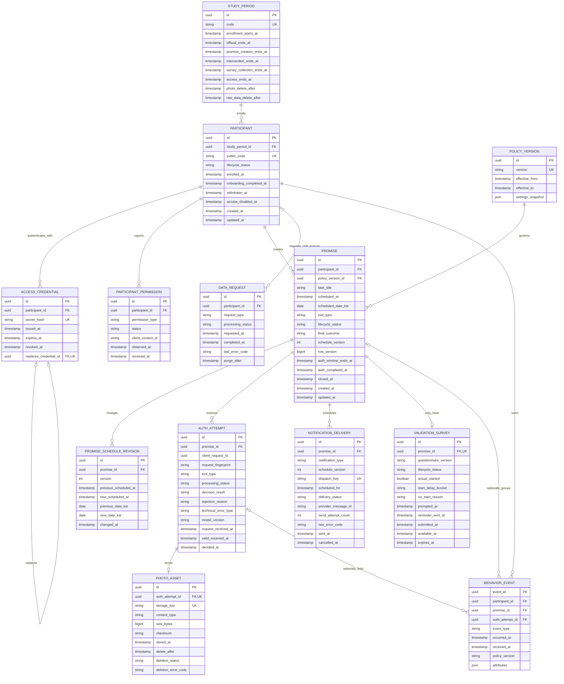

# Dodu v2.5 논리 데이터 모델과 ERD

상태: **구현 전 기술설계 초안**. 이 문서는 승인된 제품 정책이나 물리 DB 스키마가 아니다.

2026-09-22 설명 검토 후 관계와 제약을 수정했습니다. [ERD 설명서](DATA_MODEL_GUIDE.md)는
각 행의 의미, NULL·유일 제약, 생성·삭제 흐름을 설명합니다. Mermaid 그림이 구조의 원본입니다.
Notion 최신 문서는 같은 날짜에 401로 조회하지 못했습니다. 아래 내용은 저장소 v2.5 원문 기준입니다.

기준 문서는 `PRD_v2.5.md`, `SERVICE_POLICY_v2.5.md`, `FLOW_LOG_MAPPING_v2.5.md`,
`IMPLEMENTATION_CONTEXT.md`, `OPEN_DECISIONS.md`, `ACCEPTANCE_CHECKLIST.md`이다.
현재 저장소에는 DB 드라이버·ORM·마이그레이션 도구가 없으므로 DB 제품과 물리 타입은 DODU-19에서 결정한다.

## 설계 경계

- 정식 회원가입이나 소셜 로그인 대신 폐쇄형 참가자 식별과 재발급 가능한 접근 자격을 모델링한다.
- 약속의 현재 상태와 변경 이력을 분리하고, 사진 제출과 판정은 `AUTH_ATTEMPT` 단위로 연결한다.
- 사진 파일은 DB 밖의 비공개 저장 영역에 두는 기술안을 제안한다. 특정 객체 저장 서비스는 선택하지 않았으며 DB에는 파일 키와 삭제 작업 상태를 둔다.
- 알림 발송, 사용자 진입, 사진 제출, 판정 결과, 자기보고는 서로 다른 관찰 사실로 기록한다.
- 철회와 과거 데이터 삭제 요청을 구분한다. 삭제 작업은 여러 저장소에 걸쳐 추적할 수 있어야 한다.
- 모든 업무 시각은 UTC 순간으로 저장하고 KST 날짜 계산 결과가 필요한 레코드에는 별도 날짜를 보존한다.
- `D01`~`D13`의 제안은 승인 전까지 상태값, 대상 조건, 시간 제약으로 확정하지 않는다.

## ERD

## 엔티티 책임

| 엔티티 | 책임 | 주요 제약 |
|---|---|---|
| `STUDY_PERIOD` | 행동검증의 예약·개입·접근·보관 경계를 분리 | D03 승인 전 네 끝점을 하나로 합치지 않음 |
| `POLICY_VERSION` | 운영값 변경 전후 데이터 구분 | 약속 생성 시 적용 버전을 고정 |
| `PARTICIPANT` | 식별 가능한 참가자와 참여 생명주기 | 철회와 접근 만료를 구분 |
| `ACCESS_CREDENTIAL` | 재발급·폐기 가능한 접근 자격 | 평문 비밀값 저장 금지, 재발급 시 이전 자격 폐기 |
| `PARTICIPANT_PERMISSION` | 실제 관찰한 알림·카메라 권한 상태 | 권한 거부를 인증 실패로 변환하지 않음 |
| `PROMISE` | 최종 예정 시각과 현재 진행 상태 | 참가자별 활성 1개, KST 예정일별 생성 제한의 기준 |
| `PROMISE_SCHEDULE_REVISION` | 동일 `promise_id`의 일정 변경 이력 | 버전 증가, 수정 전후 시각 보존 |
| `AUTH_ATTEMPT` | 사진 1회 제출의 접수·판정·오류 | 판정 거절과 기술오류 분리, 중복 요청 키 보유 |
| `PHOTO_ASSET` | 비공개 파일 참조와 삭제 작업 상태 | 공식 종료 후 30일 이내 삭제, 완료 후 참조 행도 제거 |
| `NOTIFICATION_DELIVERY` | T/T+10/T+20 및 설문 리마인드의 실행 결과 | 발송과 수신·열람을 동일시하지 않음 |
| `VALIDATION_SURVEY` | 약속별 자기보고 상태와 응답 | 미응답을 미시작으로 변환하지 않음 |
| `BEHAVIOR_EVENT` | 보관기간 내 관찰 사실을 추가하는 원장 | 일반 수정 금지, 삭제 요청·보관 만료 시 삭제; `event_id` 중복 제거 |
| `DATA_REQUEST` | 철회·과거 데이터 삭제 처리 추적 | 철회 후 개입 중단, 삭제 범위별 완료 확인 |

## 물리 스키마에서 필요한 제약 후보

아래는 확정 정책을 보존하기 위한 후보이며 DB 제품을 고른 뒤 마이그레이션으로 구체화한다.

1. 한 참가자의 활성 약속은 최대 1개다. 부분 유니크 인덱스를 지원하지 않는 DB라면 트랜잭션 잠금과 별도 슬롯 테이블을 검토한다.
2. `participant_id + scheduled_date_kst` 제한은 취소 후에도 복구되지 않아야 한다. 취소를 이유로 약속 행을 삭제하지 않는다. 다만 삭제 요청·보관 만료는 별도이며, 날짜 이동과 기술 실패 후 제한은 D06 승인 뒤 날짜 사용 원장 필요 여부까지 결정한다.
3. 일정 세대는 `schedule_version`, 모든 약속 상태 변경의 낙관적 잠금은 `row_version`으로 구분한다. 일정 변경 이력의 유일 키는 `(promise_id, version)`이다. 서로 다른 약속에서 version=1을 허용한다.
4. 제출 유일 키는 `(promise_id, client_request_id)`이며 같은 키에 다른 요청 본문이 오면 충돌로 처리하는 기술안을 검토한다. 이벤트는 `event_id`, 논리 알림은 `dispatch_key`로 중복을 식별한다. 공급자가 발송 후 반환하는 message ID만으로 발송 중복을 예방할 수는 없다.
5. `PHOTO_ASSET.storage_key`는 공개 URL이 아닌 내부 식별자다. 파일·버전·파생본 삭제를 확인한 뒤 사진 메타데이터 행과 키도 삭제한다. 실패한 행은 재시도 대상으로 유지한다. 연결 가능한 삭제 증적을 영구 보존하지 않는다.
6. 원시 이벤트의 `promise_id`와 `auth_attempt_id`는 사건에 따라 nullable이다. 참가자 수준 사건에 가짜 FK를 만들지 않는다.
7. 개인 식별 연결을 제거한 집계와 삭제 대상 원시 데이터는 저장 영역과 접근 권한을 분리한다.
8. `PHOTO_ASSET.auth_attempt_id`와 `VALIDATION_SURVEY.promise_id`는 각각 FK이면서 UK다. 선택적 1:1 관계를 실제 제약으로 보장한다.
9. 이벤트에 시도 ID가 있으면 약속 ID도 있어야 하며, 시도→약속→참가자의 소유자가 이벤트의 FK와 일치해야 한다. 단일 FK의 존재 확인만으로는 충분하지 않다.
10. `DATA_REQUEST.participant_id`는 처리 중 필수이고 완전 삭제 완료 후 NULL로 지운다. 완료 행에는 식별자·작업명·파일 키가 없는 상태·시각·안전한 오류 코드만 두고 `purge_after`에 따라 정리한다. 실제 보존 기간은 보안 계약에서 결정한다.

## OPEN 결정과 스키마 영향

| OPEN ID | 현재 모델의 유보 방식 |
|---|---|
| D01 | 자기보고 응답값의 최종 enum과 상호배타 조건을 확정하지 않음 |
| D02, D07, D12 | 설문 생성 대상·노출 기준일·만료 기산점은 서비스 규칙으로 남기고 DB 제약으로 고정하지 않음 |
| D03 | 예약·개입·설문·접근 종료는 후보 필드로 분리하되 값·상호 순서는 미확정. 공식 종료를 보관 기산점으로 별도 기록 |
| D04, D10, D11 | 접수·판정·인증 창 종료 시각을 각각 저장하고 우선순위와 끝점 비교는 미확정 |
| D05 | 철회·권한 부재·판정 외 오류를 하나의 실패 enum으로 합치지 않음 |
| D06 | 날짜 수정과 기술 실패 후 날짜 사용 처리용 이력은 보존하되 재사용 규칙은 미확정 |
| D08 | 시도·이벤트 식별자를 분리하고 중복 제거 키를 둠. 최종 분석 계약은 미확정 |
| D09 | 생성일과 예정 시작일을 모두 계산할 수 있게 원시 시각과 KST 날짜를 보존 |
| D13 | 지원 환경·모델 QA·Go 판단 필드는 핵심 트랜잭션 스키마에 넣지 않음 |

## 구현 순서

1. DODU-19에서 DB 제품, 마이그레이션 도구, UUID·시간·JSON 물리 타입을 결정한다.
2. `STUDY_PERIOD`, `POLICY_VERSION`, `PARTICIPANT`, `ACCESS_CREDENTIAL`의 최소 보안 모델을 검토한다.
3. `PROMISE`와 일정 변경 이력의 계약을 검토하고 동시 생성·수정 검증을 준비한다. D06/D11 경계에 의존하는 운영 구현은 승인 후 진행한다.
4. 인증·알림·설문은 OPEN에 의존하는 후속 모델이다. 관련 결정 승인 전 운영 테이블·마이그레이션·사용자 동작을 구현하지 않는다. 아래 질문으로 설계만 검토한다.
5. 삭제·중복·보관 검증 시나리오를 준비한다. 데이터와 외부 저장소 도입 후 승인된 범위에서 삭제 리허설을 수행한다.
6. OPEN 결정이 승인될 때 관련 enum, 제약, 전이와 테스트를 별도 마이그레이션으로 확정한다.

## 검증 질문

- 참가자 A의 접근 자격으로 참가자 B의 약속·사진·설문을 조회할 수 없는가?
- 동시에 두 약속을 만들 때 활성 1개와 KST 예정일 1개 제한이 유지되는가?
- 일정 수정 전 알림 작업과 중복 실행이 새 상태를 바꾸지 않는가?
- 같은 사진 요청·AI 콜백·이벤트가 재전송되어도 한 번만 반영되는가?
- 마감 전 서버가 접수한 시도와 마감 후 접수 시도를 구분할 수 있는가?
- 철회 직후 예약 알림과 신규 이벤트 수집이 멈추고 늦은 판정이 행동 결과를 바꾸지 않는가?
- 삭제 요청으로 사진·원시 이벤트·설문·식별 연결을 찾아 지우고 완료를 증명할 수 있는가?
- 30일·90일 보관 작업이 비식별 집계 결과와 연결 가능한 원시 데이터를 구분하는가?
