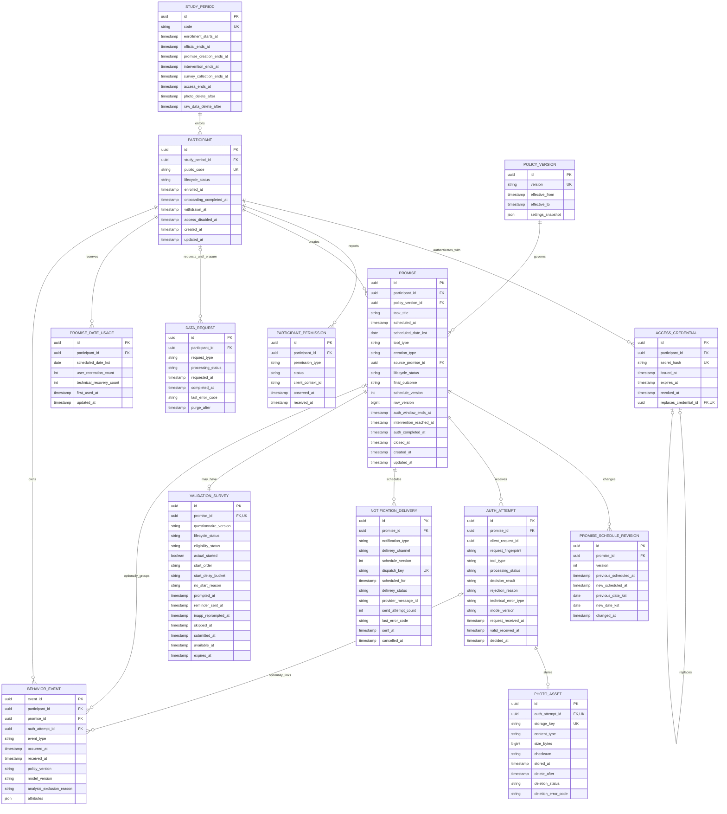

# Dodu v2.5 논리 데이터 모델과 ERD

상태: **구현 전 기술설계 초안**. 이 문서는 승인된 제품 정책이나 물리 DB 스키마가 아니다.

2026-09-28 D01~D13 최종 결정 반영을 위해 관계와 제약을 수정했습니다. [ERD 설명서](DATA_MODEL_GUIDE.md)는
각 행의 의미, NULL·유일 제약, 생성·삭제 흐름을 설명합니다. Mermaid 그림이 구조의 원본입니다.
최신 Notion LOCKED 결정문과 2026-09-27 확정 내용을 기준으로 하며, 원문 정책 문서는 변경하지 않습니다.

기준 문서는 `PRD_v2.5.md`, `SERVICE_POLICY_v2.5.md`, `FLOW_LOG_MAPPING_v2.5.md`,
`IMPLEMENTATION_CONTEXT.md`, `OPEN_DECISIONS.md`, `ACCEPTANCE_CHECKLIST.md`이다.
현재 저장소에는 DB 드라이버·ORM·마이그레이션 도구가 없으므로 DB 제품과 물리 타입은 DODU-19에서 결정한다.

## 설계 경계

- 정식 회원가입이나 소셜 로그인 대신 폐쇄형 참가자 식별과 재발급 가능한 접근 자격을 모델링한다.
- 약속의 현재 상태와 변경 이력을 분리하고, 사진 제출과 판정은 `AUTH_ATTEMPT` 단위로 연결한다.
- 사진 파일은 DB 밖의 비공개 저장 영역에 두는 기술안을 제안한다. 특정 객체 저장 서비스는 선택하지 않았으며 DB에는 파일 키와 삭제 작업 상태를 둔다.
- 알림 발송, 사용자 진입, 사진 제출, 판정 결과, 자기보고는 서로 다른 관찰 사실로 기록한다.
- 철회와 과거 데이터 삭제 요청을 구분한다. 삭제 작업은 여러 저장소에 걸쳐 추적할 수 있어야 한다.
- 모든 업무 시각은 UTC 순간으로 저장하고 KST 날짜 계산 결과가 필요한 레코드에는 별도 날짜를 보존한다.
- `D01`~`D13`은 2026-09-27 확정된 제품 정책이다. API·DB·스케줄러의 구체 구현은 기술설계에서 정하되, 관찰 사실과 상태 구분을 유지한다.

## ERD

```mermaid
erDiagram
    STUDY_PERIOD ||--o{ PARTICIPANT : enrolls
    PARTICIPANT ||--o{ ACCESS_CREDENTIAL : authenticates_with
    PARTICIPANT ||--o{ PARTICIPANT_PERMISSION : reports
    PARTICIPANT ||--o{ PROMISE : creates
    PARTICIPANT |o--o{ DATA_REQUEST : requests_until_erasure
    PARTICIPANT ||--o{ PROMISE_DATE_USAGE : reserves
    ACCESS_CREDENTIAL |o--o| ACCESS_CREDENTIAL : replaces
    POLICY_VERSION ||--o{ PROMISE : governs
    PROMISE ||--o{ PROMISE_SCHEDULE_REVISION : changes
    PROMISE ||--o{ AUTH_ATTEMPT : receives
    PROMISE ||--o{ NOTIFICATION_DELIVERY : schedules
    PROMISE ||--o| VALIDATION_SURVEY : may_have
    PROMISE |o--o{ BEHAVIOR_EVENT : optionally_groups
    AUTH_ATTEMPT ||--o| PHOTO_ASSET : stores
    AUTH_ATTEMPT |o--o{ BEHAVIOR_EVENT : optionally_links
    PARTICIPANT ||--o{ BEHAVIOR_EVENT : owns

    STUDY_PERIOD {
        uuid id PK
        string code UK
        timestamp enrollment_starts_at
        timestamp official_ends_at
        timestamp promise_creation_ends_at
        timestamp intervention_ends_at
        timestamp survey_collection_ends_at
        timestamp access_ends_at
        timestamp photo_delete_after
        timestamp raw_data_delete_after
    }
    POLICY_VERSION {
        uuid id PK
        string version UK
        timestamp effective_from
        timestamp effective_to
        json settings_snapshot
    }
    PARTICIPANT {
        uuid id PK
        uuid study_period_id FK
        string public_code UK
        string lifecycle_status
        timestamp enrolled_at
        timestamp onboarding_completed_at
        timestamp withdrawn_at
        timestamp access_disabled_at
        timestamp created_at
        timestamp updated_at
    }
    ACCESS_CREDENTIAL {
        uuid id PK
        uuid participant_id FK
        string secret_hash UK
        timestamp issued_at
        timestamp expires_at
        timestamp revoked_at
        uuid replaces_credential_id FK, UK
    }
    PARTICIPANT_PERMISSION {
        uuid id PK
        uuid participant_id FK
        string permission_type
        string status
        string client_context_id
        timestamp observed_at
        timestamp received_at
    }
    PROMISE {
        uuid id PK
        uuid participant_id FK
        uuid policy_version_id FK
        string task_title
        timestamp scheduled_at
        date scheduled_date_kst
        string tool_type
        string creation_type
        uuid source_promise_id FK
        string lifecycle_status
        string final_outcome
        int schedule_version
        bigint row_version
        timestamp auth_window_ends_at
        timestamp intervention_reached_at
        timestamp auth_completed_at
        timestamp closed_at
        timestamp created_at
        timestamp updated_at
    }
    PROMISE_SCHEDULE_REVISION {
        uuid id PK
        uuid promise_id FK
        int version
        timestamp previous_scheduled_at
        timestamp new_scheduled_at
        date previous_date_kst
        date new_date_kst
        timestamp changed_at
    }
    PROMISE_DATE_USAGE {
        uuid id PK
        uuid participant_id FK
        date scheduled_date_kst
        int user_recreation_count
        int technical_recovery_count
        timestamp first_used_at
        timestamp updated_at
    }
    AUTH_ATTEMPT {
        uuid id PK
        uuid promise_id FK
        uuid client_request_id
        string request_fingerprint
        string tool_type
        string processing_status
        string decision_result
        string rejection_reason
        string technical_error_type
        string model_version
        timestamp request_received_at
        timestamp valid_received_at
        timestamp decided_at
    }
    PHOTO_ASSET {
        uuid id PK
        uuid auth_attempt_id FK, UK
        string storage_key UK
        string content_type
        bigint size_bytes
        string checksum
        timestamp stored_at
        timestamp delete_after
        string deletion_status
        string deletion_error_code
    }
    NOTIFICATION_DELIVERY {
        uuid id PK
        uuid promise_id FK
        string notification_type
        string delivery_channel
        int schedule_version
        string dispatch_key UK
        timestamp scheduled_for
        string delivery_status
        string provider_message_id
        int send_attempt_count
        string last_error_code
        timestamp sent_at
        timestamp cancelled_at
    }
    VALIDATION_SURVEY {
        uuid id PK
        uuid promise_id FK, UK
        string questionnaire_version
        string lifecycle_status
        string eligibility_status
        boolean actual_started
        string start_order
        string start_delay_bucket
        string no_start_reason
        timestamp prompted_at
        timestamp reminder_sent_at
        timestamp inapp_reprompted_at
        timestamp skipped_at
        timestamp submitted_at
        timestamp available_at
        timestamp expires_at
    }
    BEHAVIOR_EVENT {
        uuid event_id PK
        uuid participant_id FK
        uuid promise_id FK
        uuid auth_attempt_id FK
        string event_type
        timestamp occurred_at
        timestamp received_at
        string policy_version
        string model_version
        string analysis_exclusion_reason
        json attributes
    }
    DATA_REQUEST {
        uuid id PK
        uuid participant_id FK
        string request_type
        string processing_status
        timestamp requested_at
        timestamp completed_at
        string last_error_code
        timestamp purge_after
    }
```

## 엔티티 책임

| 엔티티 | 책임 | 주요 제약 |
|---|---|---|
| `STUDY_PERIOD` | 행동검증의 예약·개입·접근·보관 경계를 분리 | `T+30 ≤ intervention_ends_at`; 종료 이후 신규 개입은 차단 |
| `POLICY_VERSION` | 운영값 변경 전후 데이터 구분 | 약속 생성 시 적용 버전을 고정 |
| `PARTICIPANT` | 식별 가능한 참가자와 참여 생명주기 | 철회와 접근 만료를 구분 |
| `ACCESS_CREDENTIAL` | 재발급·폐기 가능한 접근 자격 | 평문 비밀값 저장 금지, 재발급 시 이전 자격 폐기 |
| `PARTICIPANT_PERMISSION` | 실제 관찰한 알림·카메라 권한 상태 | 권한 거부를 인증 실패로 변환하지 않음 |
| `PROMISE` | 최종 예정 시각과 현재 진행 상태 | 참가자별 활성 1개, KST 예정일별 사용 원장과 파생 약속 연결 |
| `PROMISE_SCHEDULE_REVISION` | 동일 `promise_id`의 일정 변경 이력 | 버전 증가, 수정 전후 시각 보존 |
| `PROMISE_DATE_USAGE` | 참가자·최종 예정 시작일의 사용 및 재생성 횟수 | 취소 후 동일 날짜 재생성 1회와 기술복구 1회를 별도 제한 |
| `AUTH_ATTEMPT` | 사진 1회 제출의 접수·판정·오류 | 판정 거절과 기술오류 분리, 중복 요청 키 보유 |
| `PHOTO_ASSET` | 비공개 파일 참조와 삭제 작업 상태 | 공식 종료 후 30일 이내 삭제, 완료 후 참조 행도 제거 |
| `NOTIFICATION_DELIVERY` | T/T+10/T+20 및 설문 리마인드의 실행 결과 | 발송과 수신·열람을 동일시하지 않음 |
| `VALIDATION_SURVEY` | 대상 약속별 자기보고 상태와 응답 | AuthCompleted/AuthIncomplete만 대상; 미응답·Skipped·Expired는 unknown |
| `BEHAVIOR_EVENT` | 보관기간 내 관찰 사실을 추가하는 원장 | 일반 수정 금지, 삭제 요청·보관 만료 시 삭제; `event_id` 중복 제거 |
| `DATA_REQUEST` | 철회·과거 데이터 삭제 처리 추적 | 철회 후 개입 중단, 삭제 범위별 완료 확인 |

## 물리 스키마에서 필요한 제약 후보

아래는 확정 정책을 보존하기 위한 후보이며 DB 제품을 고른 뒤 마이그레이션으로 구체화한다.

1. 한 참가자의 활성 약속은 최대 1개다. 부분 유니크 인덱스를 지원하지 않는 DB라면 트랜잭션 잠금과 별도 슬롯 테이블을 검토한다.
2. `PROMISE_DATE_USAGE`는 참가자·최종 예정 시작일 KST 복합 유일 행으로, 사용자 취소 후 재생성 횟수와 기술실패 복구 횟수를 각각 관리한다. 일반 반복 약속은 서로 다른 최종 예정일이어야 한다.
3. 일정 세대는 `schedule_version`, 모든 약속 상태 변경의 낙관적 잠금은 `row_version`으로 구분한다. 일정 변경 이력의 유일 키는 `(promise_id, version)`이다. 서로 다른 약속에서 version=1을 허용한다.
4. 제출 유일 키는 `(promise_id, client_request_id)`이며 같은 키에 다른 요청 본문이 오면 충돌로 처리한다. 네트워크 retry는 같은 attempt로 유지하고 새 사진 제출만 새 attempt를 만든다. 이벤트는 `event_id`, 논리 알림은 `dispatch_key`로 중복을 식별한다. 공급자가 발송 후 반환하는 message ID만으로 발송 중복을 예방할 수는 없다.
5. `PHOTO_ASSET.storage_key`는 공개 URL이 아닌 내부 식별자다. 파일·버전·파생본 삭제를 확인한 뒤 사진 메타데이터 행과 키도 삭제한다. 실패한 행은 재시도 대상으로 유지한다. 연결 가능한 삭제 증적을 영구 보존하지 않는다.
6. 원시 이벤트의 `promise_id`와 `auth_attempt_id`는 사건에 따라 nullable이다. 참가자 수준 사건에 가짜 FK를 만들지 않는다.
7. 개인 식별 연결을 제거한 집계와 삭제 대상 원시 데이터는 저장 영역과 접근 권한을 분리한다.
8. `PHOTO_ASSET.auth_attempt_id`와 `VALIDATION_SURVEY.promise_id`는 각각 FK이면서 UK다. 선택적 1:1 관계를 실제 제약으로 보장한다.
9. 이벤트에 시도 ID가 있으면 약속 ID도 있어야 하며, 시도→약속→참가자의 소유자가 이벤트의 FK와 일치해야 한다. 단일 FK의 존재 확인만으로는 충분하지 않다.
10. `DATA_REQUEST.participant_id`는 처리 중 필수이고 완전 삭제 완료 후 NULL로 지운다. 완료 행에는 식별자·작업명·파일 키가 없는 상태·시각·안전한 오류 코드만 두고 `purge_after`에 따라 정리한다. 실제 보존 기간은 보안 계약에서 결정한다.

## 확정 결정과 스키마 영향

| 결정 | 데이터 모델 반영 |
|---|---|
| D01 | `actual_started`, `start_order`, `start_delay_bucket`을 인증 결과와 분리해 자기보고에 저장 |
| D02/D07/D12 | `eligibility_status`, `prompted_at`, `inapp_reprompted_at`, `skipped_at`, `expires_at`으로 대상·24시간 수명·재안내를 추적 |
| D03 | `STUDY_PERIOD`의 개입 종료와 약속별 `intervention_reached_at`으로 신규 개입과 이미 접수된 판정을 분리 |
| D04/D10/D11 | `request_received_at`, `valid_received_at`, `decided_at`, `processing_status`로 `T ≤ received < T+30`, Evaluating 잠금, 늦은 판정을 구분 |
| D05 | `lifecycle_status`와 `final_outcome`에 Cancelled/TechFailed/Permission/Withdrawn을 AuthIncomplete와 별도 저장 |
| D06 | `PROMISE_DATE_USAGE`, `creation_type`, `source_promise_id`, 일정 revision으로 수정·취소 재생성·기술복구 관계를 보존 |
| D08 | 약속·attempt·event와 `client_request_id`/`event_id`를 분리해 retry와 새 사진을 구분 |
| D09 | `scheduled_date_kst`와 `creation_type`으로 서로 다른 최종 예정일 반복과 동일 날짜 파생 약속을 분리 |
| D13 | 핵심 트랜잭션에 Go 판단을 강제하지 않고 로그·자기보고·인터뷰 및 AI/환경 QA 산출물로 별도 기록 |

## 구현 순서

1. DODU-19에서 DB 제품, 마이그레이션 도구, UUID·시간·JSON 물리 타입을 결정한다.
2. `STUDY_PERIOD`, `POLICY_VERSION`, `PARTICIPANT`, `ACCESS_CREDENTIAL`의 최소 보안 모델을 검토한다.
3. `PROMISE`와 날짜 사용 원장의 계약을 검토하고 `now+5분`, `now+72시간`, 공식 종료, 동시 생성·수정 검증을 준비한다.
4. 인증·알림·설문은 확정된 D01~D12 계약에 맞춰 운영 테이블·마이그레이션·사용자 동작을 구현한다. 내부 retry·멱등성·AI threshold는 기술설계로 기록한다.
5. 삭제·중복·보관 검증 시나리오를 준비한다. 데이터와 외부 저장소 도입 후 승인된 범위에서 삭제 리허설을 수행한다.
6. 구현 전 기술설계 리뷰에서 실제 enum, 제약, 전이와 테스트를 확정하고 결정문과 충돌하는 임의 정책을 추가하지 않는다.

## 검증 질문

- 참가자 A의 접근 자격으로 참가자 B의 약속·사진·설문을 조회할 수 없는가?
- 동시에 두 약속을 만들 때 활성 1개와 KST 예정일 1개 제한이 유지되는가?
- 일정 수정 전 알림 작업과 중복 실행이 새 상태를 바꾸지 않는가?
- 같은 사진 요청·AI 콜백·이벤트가 재전송되어도 한 번만 반영되는가?
- 마감 전 서버가 접수한 시도와 마감 후 접수 시도를 구분할 수 있는가?
- 철회 직후 예약 알림과 신규 이벤트 수집이 멈추고 늦은 판정이 행동 결과를 바꾸지 않는가?
- 삭제 요청으로 사진·원시 이벤트·설문·식별 연결을 찾아 지우고 완료를 증명할 수 있는가?
- 30일·90일 보관 작업이 비식별 집계 결과와 연결 가능한 원시 데이터를 구분하는가?
