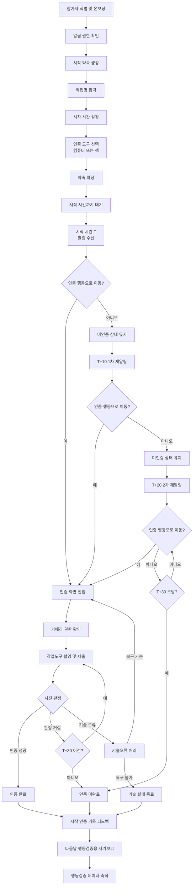
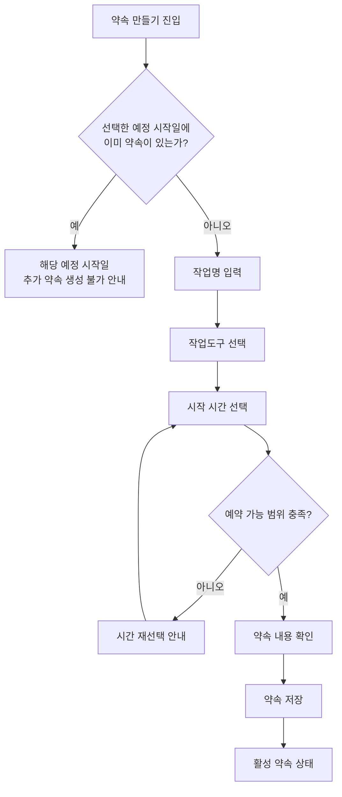
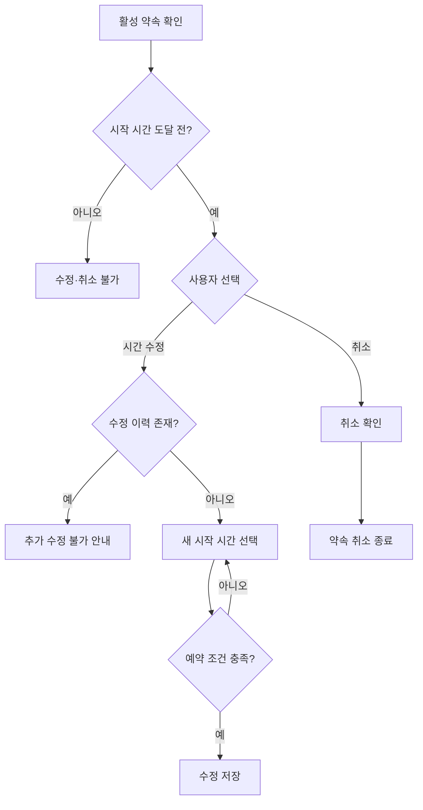
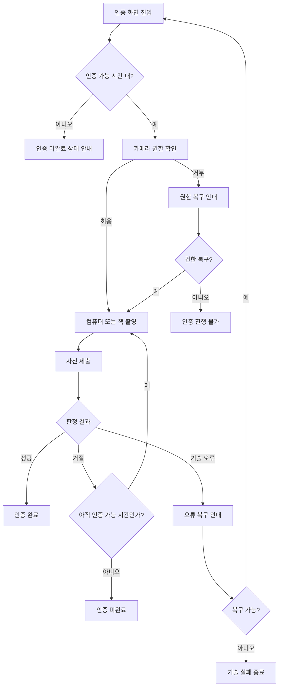
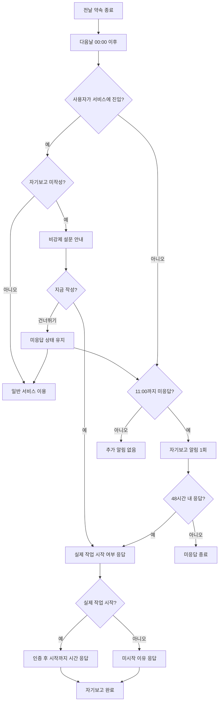
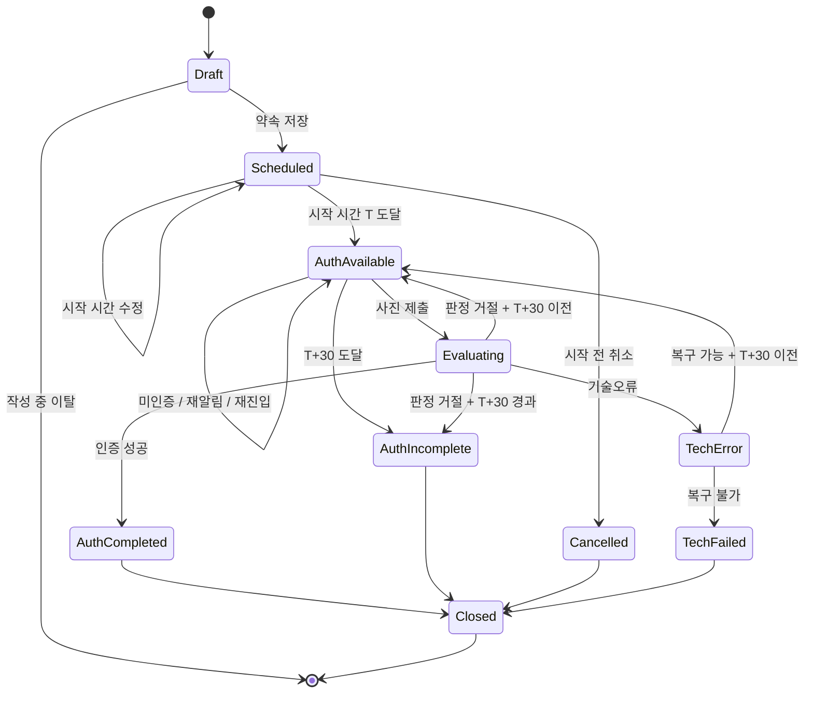
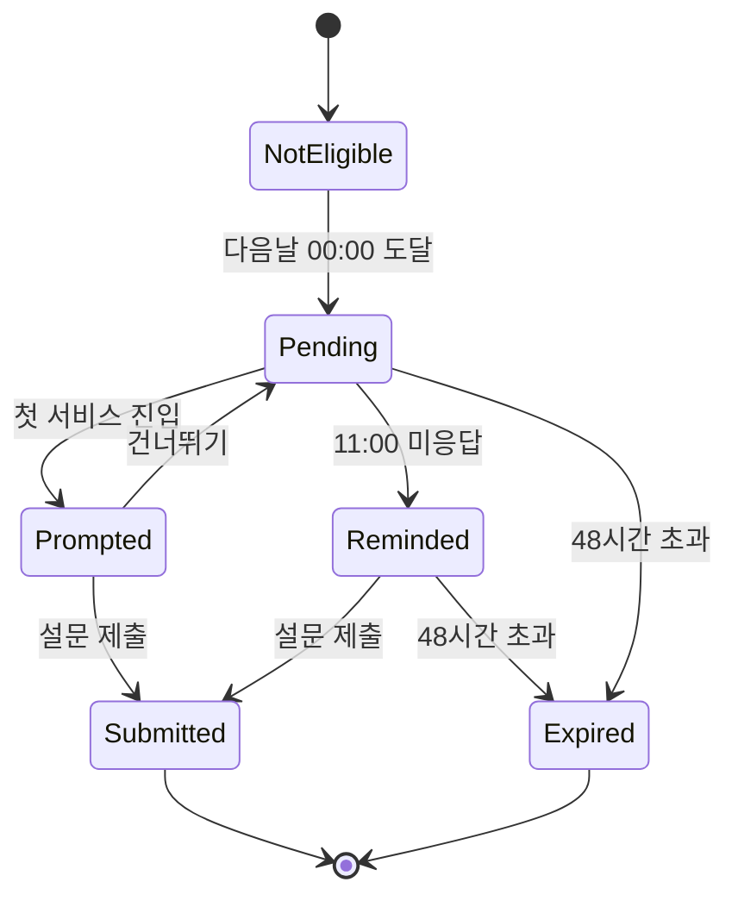
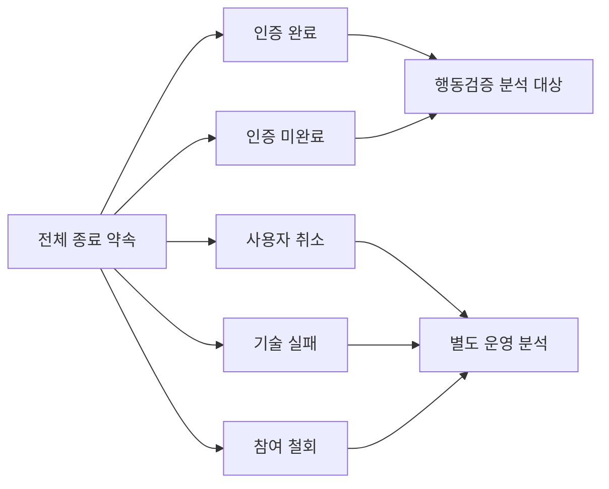

````
# MVP v2.5 — 핵심 User Flow / State Flow / 로그-검증 매핑

> 기준 문서
>
> - MVP PRD v2.5 — 시작 행동 검증 Baseline
> - 서비스 운영 정책 v2.5 — MVP 시작 행동 검증 기준
>
> 목적
>
> 1. 사용자 경험의 핵심 흐름을 한눈에 공유한다.
> 2. 디자인·FE·BE·FS가 동일한 상태 전이를 기준으로 작업한다.
> 3. MVP 행동검증에 필요한 로그가 어떤 검증 질문과 연결되는지 명확히 한다.
>
> 범위
>
> - API, DB Schema, AI 모델 내부 상태 등 기술 구현 상세는 포함하지 않는다.
> - 구체적인 운영 수치는 서비스 운영 정책 v2.5를 따른다.
> - 이벤트명·필드는 1차 제안이며, 실제 구현 방식에 맞춰 개발팀과 조정할 수 있다.

---

# 1. 핵심 User Flow

## 1.1 전체 핵심 흐름



---

## 1.2 약속 생성 흐름



> 행동검증 기간에는 KST 기준 동일한 예정 시작일에 사용자당 최대 1개 약속을 허용한다.  
> 예약 가능 범위와 수정·취소 조건은 운영 정책을 따른다.

---

## 1.3 시작 시간 수정·취소 흐름



---

## 1.4 사진 인증 상세 흐름



> 판정 거절 횟수에는 별도 제한을 두지 않는다.  
> 단, 인증 가능 시간 `T ~ T+30` 안에서만 신규 제출이 가능하다.

---

## 1.5 다음날 자기보고 흐름



---

# 2. State Flow

## 2.1 약속 기준 핵심 상태



### 상태 정의

| 상태 | 의미 |
|---|---|
| Draft | 약속 작성 중, 아직 저장 전 |
| Scheduled | 시작 시간 전의 활성 약속 |
| AuthAvailable | T~T+30, 사진 인증 가능 |
| Evaluating | 제출된 사진 판정 중 |
| TechError | 기술 문제로 정상 판정 불가 |
| AuthCompleted | 사진 인증 성공 |
| AuthIncomplete | T+30까지 인증 완료하지 못함 |
| Cancelled | 시작 시간 전 사용자가 취소 |
| TechFailed | 복구 불가능한 기술 문제로 종료 |
| Closed | 해당 약속의 개입 종료 |

---

## 2.2 자기보고 상태



---

# 3. 로그 설계 원칙

1. **시스템이 실제로 관찰한 사실만 이벤트로 기록한다.**
2. 사진 인증 성공을 실제 작업 시작으로 기록하지 않는다.
3. 기술오류와 사용자 미인증을 분리한다.
4. 알림 `발송`과 사용자 `반응`을 분리한다.
5. 수정된 약속도 하나의 `promise_id` 아래 변경 이력을 남긴다.
6. 모든 핵심 이벤트는 최소한 `participant_id`, `promise_id`, `occurred_at`을 연결할 수 있어야 한다.
7. 실제 작업 시작은 시스템 로그가 아니라 자기보고와 사후 인터뷰로 보조 측정한다.
8. 이벤트명은 구현 전 개발팀과 최종 조정할 수 있으나, **검증에 필요한 사실 자체를 삭제하면 안 된다.**

---

# 4. 핵심 이벤트 제안

| 영역 | 이벤트명 제안 | 기록 시점 | 필수 주요 값 |
|---|---|---|---|
| 참가자 | `participant_entered` | 참가자가 서비스에 진입 | participant_id, occurred_at |
| 온보딩 | `onboarding_completed` | 최초 온보딩 완료 | participant_id, occurred_at |
| 권한 | `notification_permission_changed` | 알림 권한 상태 확인/변경 | participant_id, status, occurred_at |
| 권한 | `camera_permission_changed` | 카메라 권한 상태 확인/변경 | participant_id, status, occurred_at |
| 약속 | `promise_created` | 약속 저장 완료 | participant_id, promise_id, created_at, scheduled_at, tool_type |
| 약속 | `promise_rescheduled` | 시작 시간 수정 완료 | promise_id, previous_scheduled_at, new_scheduled_at, occurred_at |
| 약속 | `promise_cancelled` | 시작 전 취소 | promise_id, occurred_at |
| 알림 | `start_notification_sent` | T 시작 알림 발송 | promise_id, scheduled_at, sent_at |
| 알림 | `reminder_sent` | T+10/T+20 재알림 발송 | promise_id, reminder_index, sent_at |
| 인증 | `auth_view_opened` | 인증 화면 진입 | promise_id, occurred_at, entry_source |
| 인증 | `auth_photo_submitted` | 사진 제출 | promise_id, occurred_at, tool_type |
| 인증 | `auth_result_received` | AI 판정 완료 | promise_id, result, occurred_at |
| 인증 | `auth_completed` | 인증 성공 확정 | promise_id, completed_at |
| 인증 | `auth_window_expired` | T+30 종료 시 미인증 | promise_id, occurred_at |
| 오류 | `technical_error_occurred` | 핵심 기술오류 발생 | promise_id, error_type, occurred_at |
| 약속 | `promise_tech_failed` | 복구 불가 기술 실패 종료 | promise_id, occurred_at |
| 피드백 | `auth_history_viewed` | 인증 기록 화면 확인 | participant_id, occurred_at |
| 자기보고 | `validation_survey_prompted` | 설문 안내 노출 | promise_id, occurred_at, trigger |
| 자기보고 | `validation_survey_reminder_sent` | 다음날 11시 리마인드 | promise_id, sent_at |
| 자기보고 | `validation_survey_submitted` | 자기보고 제출 | promise_id, actual_started, start_delay_bucket, no_start_reason, submitted_at |
| 자기보고 | `validation_survey_expired` | 48시간 미응답 종료 | promise_id, occurred_at |

### `entry_source` 예시

- start_notification
- reminder_1
- reminder_2
- direct_entry

### `auth_result_received.result` 예시

- accepted
- rejected
- technical_error

---

# 5. 로그-검증 매핑표

| 검증 질문 | 직접 확인 데이터 | 보조 데이터 | 핵심 계산/관찰 | 해석 시 주의 |
|---|---|---|---|---|
| 1. 사용자가 시작 약속을 자발적으로 생성하는가? | `promise_created` | 사후 인터뷰 | 참가자별 약속 생성 일수, 반복 생성 여부 | 검증 참여 자체가 사용을 유도할 수 있음 |
| 2. 시작 시점의 개입에 반응하는가? | `start_notification_sent` → `auth_view_opened` | 없음 | 알림 후 인증화면 진입 여부·시간 | 알림을 실제로 ‘봤는지’까지는 별도 수신/노출 기술이 없으면 단정 금지 |
| 3. 작업환경 인증 행동까지 이동하는가? | `auth_photo_submitted` | 사후 인터뷰 | 시작시점 이후 사진 제출 여부 | 사진 제출 = 실제 작업 시작 아님 |
| 4. 사진 인증이 실제 작업환경 이동을 유도하는가? | `auth_photo_submitted`, `auth_completed` | 자기보고 + 사후 인터뷰 | 인증 행동 발생 여부 + 사용자의 실제 이동 경험 | 시스템 로그만으로 ‘환경 이동’을 완전히 증명할 수 없음 |
| 5. 인증 이후 실제 작업 시작으로 이어지는가? | `auth_completed` | `validation_survey_submitted` | 인증 완료 약속 중 자기보고 실제 시작 사례 | 인과관계가 아니라 연속 행동 관찰 |
| 6. 인증만 하고 실제 작업을 시작하지 않는 사례가 발생하는가? | `auth_completed` | 자기보고 `actual_started=false` | 인증 완료 후 미시작 사례 | 자기보고 미응답은 미시작으로 처리 금지 |
| 7. 사진 인증 자체가 새로운 시작 부담이 되는가? | `auth_view_opened`, `auth_photo_submitted`, 반복 `rejected` | UT + 사후 인터뷰 | 화면 진입 후 미제출, 반복 거절, 이탈 맥락 | 로그만으로 심리적 부담을 단정하지 않음 |
| 8. 재알림이 다시 행동을 상기시키는가? | `reminder_sent` → `auth_view_opened` / `auth_photo_submitted` | 사후 인터뷰 | 재알림 이후 신규 행동 발생 여부 | 재알림이 원인이라고 단정하지 않음 |
| 9. 인증 기록 피드백을 사용자가 확인하는가? | `auth_history_viewed` | UT + 사후 인터뷰 | 피드백 화면 확인 여부·반복 확인 | 확인 = 가치 인식은 아님 |
| 10. 사용자가 이후 다시 약속을 생성하는가? | 반복 `promise_created` | 사후 인터뷰 | 참가자별 서로 다른 날짜의 반복 생성 | 하루 1개 제한을 고려 |
| 11. 미시작 원인은 무엇인가? | 없음 | 자기보고 `no_start_reason` + 사후 인터뷰 | 이유 유형 분포·반복 패턴 | 자기보고 선택지는 완전한 원인분류가 아님 |

---

# 6. 핵심 파생 지표 제안

> 초기 행동검증에서 참고하기 위한 지표이며, 통계적 효과를 증명하는 지표로 사용하지 않는다.

| 지표 | 계산 방식 | 의미 |
|---|---|---|
| 약속 반복 생성 | 2개 이상의 서로 다른 날짜에 `promise_created`가 있는 참가자 | 반복 사용 신호 |
| 시작 개입 반응 | 시작 알림 이후 T+30 전 `auth_view_opened` 발생 여부 | 개입 후 서비스 반응 |
| 인증 시도 | T+30 전 `auth_photo_submitted` 발생 여부 | 행동 요구까지 이동 |
| 인증 완료 | `auth_completed` 발생 여부 | 시스템이 확인한 인증 행동 완료 |
| 인증 지연시간 | `auth_completed_at - scheduled_at` | 시작 약속 이후 인증까지 시간 |
| 재알림 후 반응 | 재알림 이후 다음 행동 이벤트 발생 여부 | 추가 리마인드 이후 행동 신호 |
| 인증→실제 시작 연결 | 인증 완료 + 자기보고 실제 시작 | 실제 시작과의 연결 신호 |
| 인증 후 미시작 | 인증 완료 + 자기보고 미시작 | 대리 행동 위험 |
| 기술 실패 | `promise_tech_failed` 발생 약속 | 제품 효과와 분리해야 할 운영 품질 문제 |
| 자기보고 응답 | `validation_survey_submitted` / 자기보고 대상 약속 | 보조 측정 데이터 확보 수준 |

---

# 7. 분석에서 반드시 분리할 상태



### 기본 원칙

- `인증 완료`와 `인증 미완료`를 핵심 행동 데이터로 본다.
- 기술 실패를 사용자 미인증에 포함하지 않는다.
- 시작 전 취소를 인증 미완료에 포함하지 않는다.
- 참여 철회를 사용자 실패로 처리하지 않는다.
- 자기보고 미응답을 실제 작업 미시작으로 처리하지 않는다.

---

# 8. 역할별 활용

| 역할 | 이 문서에서 확인할 부분 |
|---|---|
| PO | 검증 질문 ↔ 로그 ↔ 다음 의사결정 연결 |
| PD | User Flow, 상태 분기, 오류/권한/자기보고 노출 |
| FE | 화면별 상태, 이벤트 발생 시점, 사용자 진입 경로 |
| BE | Promise 상태 전이, 이벤트 저장, 시간 정책, 종료 처리 |
| FS | 알림 스케줄링, 통합 상태, 배포·운영 환경 |
| AI Engineer | 사진 제출 → 판정 결과 계약, 오류 상태, QA 범위 |

---

# 9. 1차 배포 후 팀 피드백에서 확인할 것

1. 현재 Flow로 구현이 불가능하거나 지나치게 비싼 부분이 있는가?
2. FE/BE/FS/AI 사이에서 소유권이 불명확한 상태가 있는가?
3. 상태 전이가 누락되어 구현자가 임의 판단해야 하는 부분이 있는가?
4. 검증에 반드시 필요한 이벤트 중 현재 기술구조에서 남기기 어려운 것이 있는가?
5. AI 판정의 입력·출력 Contract를 별도 정의해야 하는 지점은 무엇인가?
6. 정책 수치가 구현 방식 때문에 변경되어야 하는 부분이 있는가?
7. User Flow에 사용자가 실제로 이해하기 어려울 것으로 예상되는 단계가 있는가?

---

# 10. 1차 배포 이후 문서 처리 원칙

- 제품 문제·타깃·핵심 가설·MVP Scope가 바뀌지 않는 피드백은 PRD를 수정하지 않는다.
- 시간·횟수·운영 조건 변경은 서비스 운영 정책에서 처리한다.
- 화면 구조·인터랙션 변경은 디자인 문서에서 처리한다.
- API·DB·배포·AI 모델 구현 변경은 기술설계에서 처리한다.
- 검증에 필요한 사실이 달라질 경우 로그-검증 매핑표를 수정한다.
- 핵심 솔루션 자체가 구현 불가능하거나 무의미하다는 근거가 생긴 경우에만 PRD Baseline을 다시 연다.
````